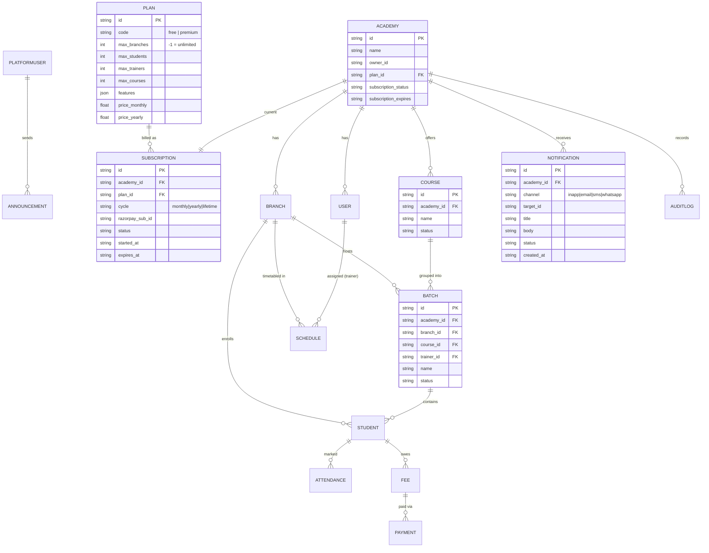

# AM 360 — Architecture, Data Model & Phased Roadmap

> **Source of truth:** the product requirements in `Academy_Management_SaaS_Claude_AI_Prompt.docx`.
> **Decision (agreed):** deliver those requirements on the **existing Next.js 14 + Prisma + PostgreSQL** web stack (Vercel-hosted), **not** the doc's literal Android/Spring Boot stack. The rationale and the full mapping are below. Every non-trivial design decision is explained, per the doc's instruction.

---

## 1. Stack decision & why it differs from the doc

The doc asks for **Kotlin/Jetpack Compose Android + Java Spring Boot**. This repo is already a working **Next.js 14 (App Router) + Prisma + PostgreSQL** SaaS covering the same product domain, deployed on Vercel.

| Doc's ask | What we ship instead | Why |
|---|---|---|
| Android APK (Kotlin/Compose) | Responsive web app (React 18/Next.js) | One codebase serves web + mobile browsers; installable as a PWA later. Fits the existing Vercel-only workflow; no Play Store / signing pipeline needed. |
| Java Spring Boot + JWT + JPA | Next.js API routes (Node runtime) + Prisma + JWT | Frontend and API share one deployment and domain (no CORS), auto-scaling serverless on Vercel Hobby. Prisma gives the same type-safe, migration-driven relational model JPA+Flyway would. |
| PostgreSQL, Redis, Docker | PostgreSQL (Neon pooled), no Redis/Docker for v1 | Postgres is identical. Redis/Docker are infra the serverless host abstracts away; we add caching only if a real hotspot appears. |
| Cloudinary, FCM, Razorpay | Cloudinary (done), Razorpay (web checkout), web push / provider APIs for messaging | Same third parties, called from serverless routes. |

**Net:** identical *product* (multi-tenant academy SaaS, same roles, same modules), delivered in the stack already in this repo. The Android app remains a documented **future** option that can consume the same REST API.

---

## 2. Requirements → current state gap analysis

Legend: ✅ done · 🟡 partial · ❌ missing

### Roles
| Role | Status | Notes |
|---|---|---|
| Super Admin (platform) | ❌ | No platform-level role. `User.role` is only `owner \| admin \| trainer`, always scoped to one academy. **Biggest gap.** |
| Academy Owner | ✅ | `register-owner`, full admin panel. |
| Trainer | ✅ | Trainer workspace + schedule + profile. |
| Student (future) | ❌ (intended future) | Out of scope for now, per doc. |

### Academy Owner modules
| Module | Status |
|---|---|
| Dashboard / analytics | ✅ (`/api/analytics/dashboard`) |
| Branch | ✅ CRUD |
| Trainer | ✅ CRUD (multi-branch) |
| Student | ✅ CRUD + search/filter/transfer |
| Attendance | ✅ mark/summary + class photos |
| Fees | ✅ Fee + Payment history |
| Schedule / Batch | 🟡 `Schedule` exists; **Batch & Course are only free-text strings on Student**, not managed entities |
| Reports | ❌ no report endpoints, no PDF/Excel export |
| Notifications | ❌ no model, no delivery |
| Subscription | 🟡 fields on `Academy`, **no plan-limit enforcement, no Razorpay, no upgrade UI** |
| Settings | ✅ |
| Audit logs | ✅ |

### Plan enforcement (Free vs Premium)
❌ **Not enforced anywhere.** Confirmed: no count/limit checks in student/branch/trainer create routes. Free-plan caps (1 branch, 5 students, 2 trainers, 2 courses) and the upgrade popup do not exist yet.

---

## 3. Target architecture

```
Browser (React/Next.js pages)  ──►  Next.js API routes (/api/*, Node runtime)
        │  JWT in Authorization header        │
        │                                     ├─ Prisma Client ──► PostgreSQL (Neon, pooled)
        │                                     ├─ Cloudinary (signed uploads)
        │                                     ├─ Razorpay (orders/webhooks)
        │                                     └─ Messaging providers (email/SMS/WhatsApp)
        └─ AuthContext (token in localStorage)
```

- **Serverless-safe Prisma singleton** (already in `src/lib/prisma.ts`).
- **Multi-tenancy:** every domain row carries `academy_id`; every query filters by the caller's `academy_id` from the JWT. Super Admin is the only role that queries *across* academies.
- **Runtime:** Node (not Edge) on API routes — Prisma + bcrypt + jsonwebtoken require Node.

---

## 4. RBAC model (with the new Super Admin)

Two authentication surfaces, one token format (JWT with `sub`, `role`, `academy_id`):

- **Platform surface** — a new `PlatformUser` (super admin). `academy_id` is null/sentinel; `role = "superadmin"`. Manages academies, plans, subscriptions, announcements, platform analytics.
- **Tenant surface** — existing `User` (`owner`/`admin`/`trainer`) scoped to one academy.

**Enforcement helper** (extend `src/lib/auth.ts`): `requireRole(req, [...roles])` returning 401/403. Super Admin endpoints live under `/api/admin/*` (platform) and reject any non-superadmin token. This keeps tenant and platform authorization physically separate.

---

## 5. Data model / ERD

### 5.1 Proposed schema additions

New models: **PlatformUser**, **Plan**, **Subscription** (billing history), **Course**, **Batch**, **Notification**, **Announcement**. Course/Batch become first-class (keep the string columns on `Student` during migration for back-compat, then backfill FKs).



(Existing models — Academy, User, Branch, Student, Attendance, ClassSession, Fee, Payment, Schedule, AuditLog — stay as in `prisma/schema.prisma`.)

### 5.2 Convention note
Keep the existing conventions: `snake_case` scalar fields, string ISO dates, `uuid()` PKs, explicit `@@index` on `(academy_id, …)`. This preserves the current JSON API contract so existing pages don't break.

---

## 6. Plan-limit enforcement (Free vs Premium)

Central guard `assertWithinPlan(academy_id, resource)` in a new `src/lib/plan.ts`:

1. Load the academy's `Plan` (cache in-memory per request).
2. `count()` current active rows for the resource.
3. If `plan.max_x != -1 && count >= plan.max_x` → throw `PlanLimitError` → route returns **402 Payment Required** with `{ code: "PLAN_LIMIT", resource, limit }`.
4. Frontend intercepts `PLAN_LIMIT` and shows the **upgrade popup**.

Called at the top of every create route: students, branches, trainers, courses. Free plan seed: `max_branches 1, max_students 5, max_trainers 2, max_courses 2`. Premium: all `-1`, `features` flags on (reports, export, messaging, backup).

---

## 7. REST API surface

**Existing (keep):** auth (login/register-owner/me/change-password), academy, branches, trainers (+reset-password), students (+transfer), attendance (mark/summary), sessions, fees (+pay), schedules, audit, analytics/dashboard, uploads/sign.

**New — tenant:**
- `GET/POST /api/courses`, `GET/PATCH/DELETE /api/courses/[id]`
- `GET/POST /api/batches`, `GET/PATCH/DELETE /api/batches/[id]`
- `GET /api/reports/attendance`, `/api/reports/fees`, `/api/reports/trainers` (`?from&to&branch_id&format=json|csv|pdf`)
- `POST /api/notifications` (send), `GET /api/notifications`
- `GET /api/subscription`, `POST /api/subscription/checkout` (Razorpay order), `POST /api/subscription/webhook`

**New — platform (superadmin only, `/api/admin/*`):**
- `POST /api/admin/auth/login`
- `GET /api/admin/academies`, `PATCH /api/admin/academies/[id]` (activate/deactivate/suspend/delete)
- `GET/POST/PATCH /api/admin/plans`
- `GET /api/admin/analytics` (platform-wide: academies, MRR, active users, usage)
- `POST /api/admin/announcements`

---

## 8. Reports & export

- Query layer aggregates from Attendance/Fee/Payment with `academy_id` + date-range + branch filters.
- **CSV**: reuse/extend `src/lib/csv.ts` — zero new deps, streams a `text/csv` response.
- **PDF**: render server-side with a lightweight HTML→PDF path; gate behind Premium `features.export`.
- **Excel**: emit CSV for v1 (opens in Excel); true `.xlsx` only if requested.
- Report types per doc: daily/monthly attendance, fee collection, trainer performance.

## 9. Notifications (Vercel-friendly)

| Channel | Provider suggestion | Notes |
|---|---|---|
| Email | Resend / SMTP | Simplest; good for receipts, reminders. |
| SMS | Twilio / MSG91 | India-friendly (MSG91) for Razorpay audience. |
| WhatsApp | Twilio WhatsApp / Meta Cloud API | Template messages for fee reminders. |
| In-app / push | Web Push (VAPID) | Replaces FCM for the web app. |

All behind a `NotificationService` interface so providers are swappable; Premium-gated.

## 10. Security

JWT (Node routes) · bcrypt hashing · `requireRole` RBAC · per-tenant `academy_id` scoping on every query · input validation at route boundaries · audit logging on all mutations (already present) · Razorpay webhook signature verification · secrets via Vercel env vars (no fallbacks — `JWT_SECRET` already fails loudly).

## 11. Folder structure (additions)

```
src/
  app/
    admin/                 # existing tenant-owner UI
    superadmin/            # NEW platform console (login, academies, plans, analytics, announcements)
    api/
      admin/               # NEW platform endpoints
      courses/ batches/ reports/ notifications/ subscription/   # NEW tenant endpoints
  lib/
    plan.ts                # NEW plan-limit guard
    rbac.ts                # NEW requireRole helper
    reports.ts             # NEW aggregation + CSV/PDF
    notify.ts              # NEW NotificationService
```

---

## 12. Phased roadmap

Mapped from the doc's 5 phases onto this stack. Each phase ends deployable on Vercel.

| Phase | Doc phase | Deliverables | Key files |
|---|---|---|---|
| **P1 — Foundation & plan limits** | 1 (Architecture/DB/ERD/API) | This doc; `Plan` model + seed; `assertWithinPlan` guard wired into create routes; upgrade-popup on 402; Course & Batch models + CRUD + API | `prisma/schema.prisma`, `lib/plan.ts`, `api/courses`, `api/batches` |
| **P2 — Super Admin** | 4 (Admin panel) | `PlatformUser` + `/api/admin/*`; superadmin login; academies management (activate/suspend/delete); plans management; platform analytics; announcements | `app/superadmin/*`, `api/admin/*`, `lib/rbac.ts` |
| **P3 — Reports & export** | — (top TODO) | Attendance/fees/trainer reports; CSV export (all), PDF export (Premium) | `lib/reports.ts`, `api/reports/*` |
| **P4 — Subscriptions** | 4 | Razorpay orders + webhook; monthly/yearly/lifetime; auto plan up/downgrade; billing history (`Subscription`) | `api/subscription/*`, `lib/razorpay.ts` |
| **P5 — Notifications & polish** | 5 (Testing/Docker/Deploy) | NotificationService (email/SMS/WhatsApp/push); fee reminders; finish Owner/Trainer UI (deactivate/transfer/reset buttons, full form fields); backup/restore (Premium); tests + deploy checklist | `lib/notify.ts`, `api/notifications`, UI wiring |

**Sequencing rationale:** P1 first because plan limits + Course/Batch are load-bearing for both the product (Free/Premium is the business model) and later phases (Super Admin manages plans, subscriptions change plans). Super Admin (P2) before Subscriptions (P4) so there's a console to observe billing. Reports (P3) slot in early because they're the #1 changelog TODO and are self-contained.

---

## 13. Open decisions to confirm before P1 build
1. **Super Admin bootstrap:** seed via env-configured credentials, or a one-time protected setup route?
2. **PDF export:** acceptable to add a small PDF lib, or must we stay zero-dep (HTML print view only)?
3. **Messaging provider:** which of Resend/Twilio/MSG91 do you have accounts for? (Determines P5 concretely.)
4. **Course/Batch migration:** backfill existing string `course`/`batch` values into the new tables, or start clean?
